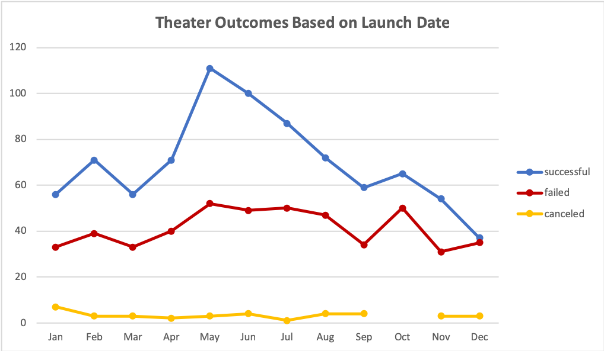
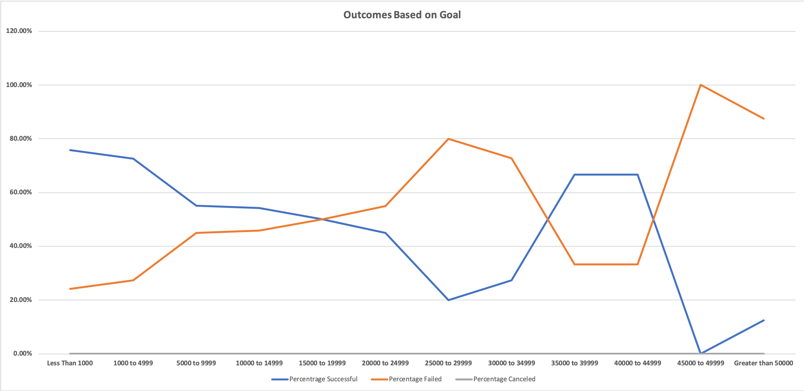

# Kickstarting with Excel

## Overview of Project

### Purpose
My client Louise ran a kickstarter campaign for her play Fever and came close to her goal. She would like to understand the relationship between the launch dates and funding goals to the outcomes of other kickstarter campaigns. 

## Analysis and Challenges

### Analysis of Outcomes Based on Launch Date
In order to analyze how theater campaigns fared based on their launch date, I created a pivot table summarizing the number of campaigns that were successful, failed, or canceled by the month the campaign launched. I added a filter for the Parent Category column and filtered the pivot table to only display Theater campaigns.

I then created a line chart to vizualize the results:


The chart clearly shows that the greatest number of successful theather campaigns were launched during the summer months, May through July. 

### Analysis of Outcomes Based on Goals
In order to analyze how campaigns for plays fared based on their goal amount, I created a new table to calculate how many play campaigns were successful, failed, or cancelled based on the range of their goal. 

I used the COUNTIFS formula to count how many campaigns fell into each category filtering on their goal amount, outcome, and subcategory. Below is an example forumla:
```
=COUNTIFS(Kickstarter!$D:$D, ">=1000", Kickstarter!$D:$D, "<=4999", Kickstarter!$F:$F, "=successful", Kickstarter!$R:$R, "=plays")
```

I then created a line chart to vizualize the results:


According to the chart, play campaigns with a goal less than 1000 had the highest success rate of approximately 75%. More than 50% of campaigns with a goal of less than 15,000 or between 35,000 and 44,999 were successful. There is also a clear spike in failure percentage when the goal is greater than 45,000.

### Challenges and Difficulties Encountered
I encountered some difficulties during my analysis:
1. At first my pivot table included the data from the entire sheet, which introduced "Blank" values into my pivot table. I had to change the data range to only include the cells with values.
2. I had some difficulty trying to change the colors on the theater outcomes line chart. I changed the Line color but the Marker color did not change. I eventually found how to format the fill and the border of the Marker to match the new color of the line. 
3. When creating the COUNTIFS forumlas for the outcomes based on goals table I tried to use the text in the Goal column to filter within the formula. This did not work and I had to hardcode min and max criteria in the forumla.
4. To get the x-axis labels correctly displayed on the Outcomes Based on Goals line chart I had to change the selected data for the x-axis to be the values in the Goal column. 


## Results

- What are two conclusions you can draw about the Outcomes based on Launch Date?
1. The months with the most successful campaigns were May through July. 
2. The total number of campaigns launched and the percentage successful declines towards the end of the year. 

- What can you conclude about the Outcomes based on Goals?
1. Play campaigns tend to have a higher percentage of success the lower the goal amount. 
2. Play campaigns with a goal over 45,000 had an over 80% failure rate. 

- What are some limitations of this dataset?
1. The data does not include much of any information about how the campaign was marketed. 
2. The dataset only goes back to 2009.
3. The dataset does not include the currency exchange ratios when the campaigns were run, which could result in some inaccurate comparisons across different currency amounts. 

- What are some other possible tables and/or graphs that we could create?
1. We could have converted all of the amounts into USD based on historical exchange ratios before creating our data based on goal amount to get a better comparison across different currencies. 
2. We could have created a graph vizualizing the outcomes based on campaign duration. 
