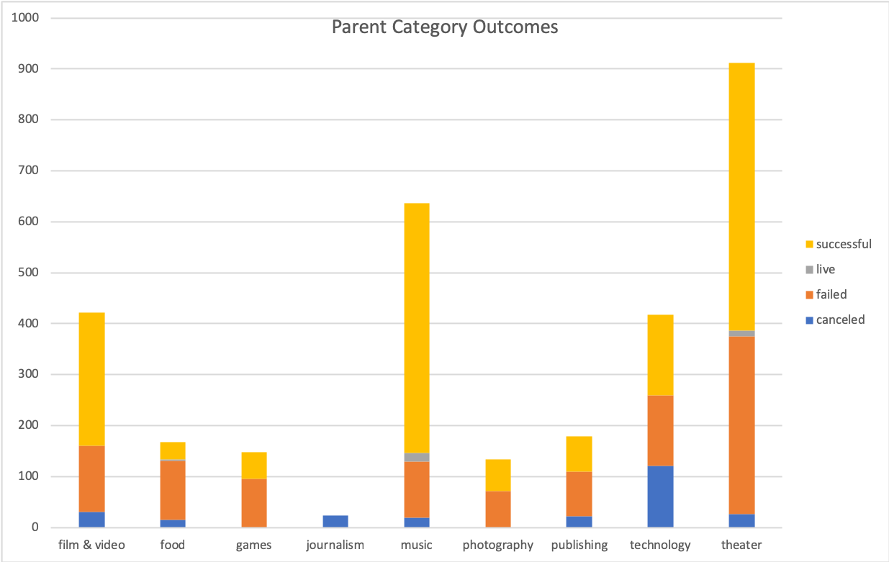
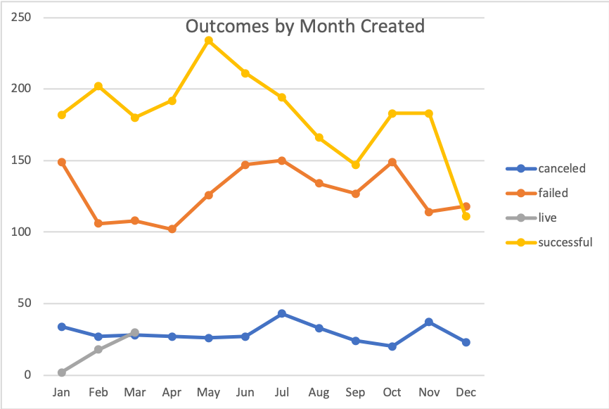
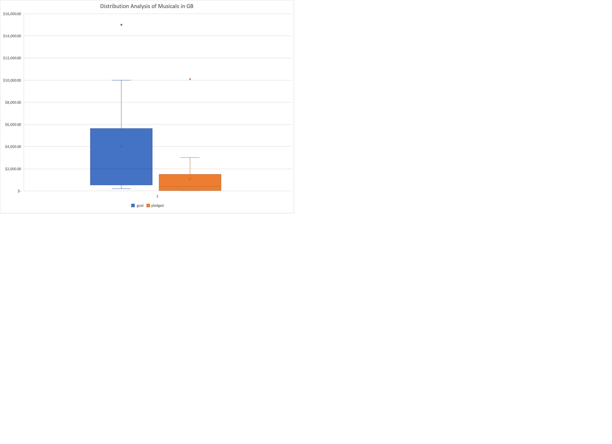

# An Analysis of Kickstarter Campaigns
Performing analysis on Kickstarter data to uncover trends

## Analysis
The data shows that kickstarters related to the theater are very popular and over half of them are successful.

The data also shows that theater kickstarters beginning in May or June had the highest number of successful campaigns.

For kickstarters in the US, the mean and median goal for successful campaigns was much lower than that of failed campaigns ($5,049 and $3,000 for successful vs $10,554 and $5,000 for failed). However, the mean and median pledged amounts showed the opposite with failed campaigns pledged amounts being much lower than successful ones ($5,602 and $3,168 for successful vs $559 and $103 for failed). This indicates that a lower goal amount may make for a more likely successful campaign but there are more factors than just the goal amount contributing to the success or failure of the campaign.

For musical campaigns in Great Britan, the mean goal is around $4,000 which would be considered an outlier in terms of amount pledged. The median goal is closer to $2,000 and even that is above the 3rd quartile for pledged amounts.

## Recommendations
Based on the data I would recommend starting the campaign in the early summer for the best chance at success. 

I would also recommend keeping the goal amount conservative, ideally in the $1,500 to $5,000 range to be within the IQR of past successful US campaigns.

For a musical campaign in Great Britan, I would recommend keeping the goal amount ideally at or below $2,000 which is the median goal, if not below $1,500 which is about the top of the IQR for amounts pledged. 

